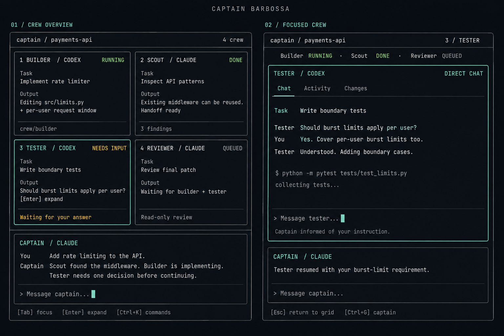
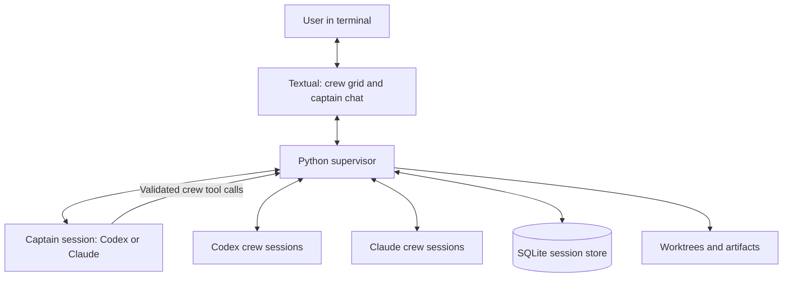

**Captain Barbossa — product and implementation plan**

Design proposal, 6 September 2026. Working command: `captain`. This workspace contains a plan and a UI concept; the CLI has not been implemented. Package and command-name availability have not been checked.

Build a Python terminal application in which you chat with one **captain**, watch its **crew** work in a grid above, and expand any crew member into a direct conversation. The captain chooses assignments and combines results; the application owns scheduling, processes, permissions, and persistence.

The proposed first release focuses on coding teams on macOS and Linux, including WSL. Roles remain configurable so the same session model can later support research and writing. This scope is a working assumption, not a confirmed restriction from the user.



The generated image shows two states of the same application. It establishes the layout and visual direction; the interaction rules below are the implementation specification. Provider assignments in the image are examples, not a claim that one model is inherently best at a role. The image was made with the built-in image generation tool; its exact [prompt is saved here](assets/ui-prompt.txt).

**The experience starts with a mission.** Run `captain` inside a project and describe an outcome: “Add API rate limiting, write boundary tests, and review the patch.” The captain inspects the project, proposes short assignments in its conversation, and dispatches independent work within the configured permissions. Routine delegation does not require a confirmation for every agent.

| Role | Responsibility | Typical access |
| --- | --- | --- |
| Captain | Understand the goal, assign work, resolve dependencies, assess evidence, summarize results | Project reading and crew control |
| Scout | Inspect existing patterns and return relevant findings | Read-only |
| Builder | Implement a bounded change | Its assigned worktree |
| Tester | Develop and run relevant checks | Its assigned worktree |
| Reviewer | Review a specific combined revision | Read-only project access; separately controlled test commands |

Either Codex or Claude can serve as captain or crew. Roles are instructions and permissions attached to sessions, not separate implementations. Users choose provider/model per role; the captain chooses among configured profiles. Begin with four active crew slots, plus the captain, and queue additional assignments. Simple tasks should use fewer agents when delegation would add overhead.

**The terminal has two main views.** In the overview, the crew grid occupies roughly the upper two-thirds, and the captain conversation occupies the lower third. A small header shows project and session; a footer shows context-sensitive shortcuts. Each crew pane displays name, provider, task, textual status, recent messages/tool activity, elapsed time, and a workspace or artifact reference. Show observable activity and actual completed checks; do not invent percentage progress or private reasoning.

Selecting a pane and pressing Enter expands it across the crew area. Other agents continue running, represented by a compact status strip. The expanded pane offers Chat, Activity, and Changes; a non-code task can show Artifacts instead. The captain stays docked below with a smaller transcript. Each composer names its recipient, and only the focused composer accepts input. Preserve drafts and scroll position per conversation when switching views.

| Input | Behavior |
| --- | --- |
| Tab / Shift+Tab | Move through panes and controls |
| Arrow keys on a pane header | Select an adjacent crew pane |
| Enter on a selected pane header | Expand that crew |
| Click a pane / its Expand control | Select / expand with a mouse |
| Escape | Dismiss an open overlay, otherwise return to the crew grid |
| Ctrl+G | Focus the captain composer |
| Ctrl+K | Open commands: focus, interrupt, retry, approvals, session, quit |
| Enter in a composer | Send to the named recipient |
| Ctrl+J in a composer | Insert a newline; preserve multiline paste |
| Ctrl+C | Interrupt the focused agent's active turn; never silently discard a draft |
| Ctrl+Q | Quit through a session shutdown dialog when work is active |

Keybindings are proposals to verify in real terminals. Actions must also be reachable through the command palette. Pane shortcuts apply only when a pane header is focused, so typing numbers or letters in chat cannot accidentally control agents.

At approximately 120 columns by 36 rows, use a 2×2 grid and a captain dock of at least eight rows. Below that, switch to a tabbed crew area with one readable pane and the captain below. Very small terminals show a compact conversation switcher. Larger terminals can use three columns. Additional crew use pages or scrolling rather than continually shrinking every pane. Use terminal-cell borders, theme-compatible colors, visible focus, and status words as well as color; avoid requiring Nerd Fonts. Support plain transcript export for access outside the full-screen UI.

**Direct chat must remain coordinated.** Opening a crew pane only changes the view. Sending a message enters human control for that crew, records the exact instruction and its source, and informs the captain. Other crew remain under captain control. While human control is active, the captain may inspect that crew but cannot dispatch competing instructions to it.

By default, messages to a running agent queue for its next turn, with a visible “queued” marker. An explicit Interrupt and send action stops the active turn, waits for its completion/cancellation signal, and sends the replacement instruction. An already-issued command may have produced effects; cancellation is not rollback. Returning to the grid releases human control after pending direct messages are delivered. The captain receives a handoff and replans rather than replaying stale queued assignments. Serialize all inputs per agent and reject stale task revisions.

**Use Python with Textual for the interface.** Textual provides the grid layout and background worker facilities needed here, and its headless testing tools can exercise keyboard interaction. It is the one substantial UI dependency worth taking. Use its widgets and styling, with Rich rendering where available through Textual. Sources: [layout](https://textual.textualize.io/guide/layout/), [workers](https://textual.textualize.io/guide/workers/), and [testing](https://textual.textualize.io/guide/testing/).

| Concern | Choice | Reason |
| --- | --- | --- |
| Runtime | Python 3.11+ | Standard async orchestration and TOML reading |
| CLI parsing | `argparse` | Small command surface; no extra CLI framework |
| Terminal UI | `textual` | Layout, focus, input, rendering, testing |
| Concurrency | `asyncio`, queues, subprocess APIs | One supervisor with independent agent tasks |
| Persistence | Standard-library `sqlite3` | Durable session state and searchable history |
| Configuration | `captain.toml` via `tomllib` | Roles, providers, concurrency, permissions |
| Coding isolation | Git worktrees | Separate working directories for writers |
| Claude integration | `claude-agent-sdk` | Existing agent runtime and tools |
| Codex integration | Installed Codex app-server over stdio | Structured messages directly from Python |
| Development/install | `pyproject.toml`, `uv`; pip-compatible package | Normal Python tool distribution |

The application owns its UI and consumes structured provider events. Embedding complete interactive CLIs in pseudo-terminals would require terminal emulation, screen scraping, and conflicting keyboard ownership. Structured integrations better match the requested chat and orchestration behavior. Keep providers' underlying tool loops rather than reimplementing code editing and shell tools.

**Provider integrations need an early feasibility check.** For Codex, use `codex app-server` with newline-delimited JSON over stdio: initialize, create/resume a thread, start turns, consume events, handle approvals, and interrupt. Give each agent its own owned process initially for independent lifecycle management. Captain control functions can use `dynamicTools`, which are experimental; the app-server documentation also flags experimental support. Pin the tested CLI version and prove this path before committing to the product architecture. A documented MCP integration is a fallback to evaluate if this gate fails, not another transport to build immediately. Source: [official OpenAI App Server documentation](https://learn.chatgpt.com/docs/app-server).

For Claude, use a persistent `ClaudeSDKClient`, partial message streaming, `interrupt()`, session resume, permission callbacks, and SDK custom tools. Bind captain control functions using the SDK's in-process tool support. Keep one client per captain/crew session. Source: [Claude Python Agent SDK reference](https://code.claude.com/docs/en/agent-sdk/python).

The two adapters should share only the operations the product uses: open/resume, send, stream, interrupt, answer a permission request, close, and expose captain tools. A small typed contract has two real implementations here. Keep provider-specific metadata attached to events instead of pretending every provider has identical capabilities. In-place steering can follow later; queued messages plus explicit interruption give both providers consistent initial behavior.

**Authentication belongs in the first milestone.** Codex supports ChatGPT sign-in and API-key authentication; use its supported flow and credential storage. Claude's SDK documentation says third-party products must use API authentication unless separately approved to offer claude.ai login or limits. The initial Claude setup therefore uses `ANTHROPIC_API_KEY`; do not promise reuse of a Claude Pro/Max subscription. Sources: [Codex authentication](https://learn.chatgpt.com/docs/auth), [Claude SDK overview](https://code.claude.com/docs/en/agent-sdk/overview), and [Claude SDK setup](https://code.claude.com/docs/en/agent-sdk/quickstart).

`captain doctor` should report installed versions, provider availability, credential presence without printing secrets, and sandbox capabilities. A separate, explicitly invoked connection check can make a minimal billable request. This planning session only inspected local CLI versions/help: Codex 0.153.4 and Claude Code 2.1.261 were present. Authentication, SDK installation, and live provider interoperability were not tested.

**The captain makes decisions; the supervisor executes them.** Keep one application process containing the TUI, supervisor, and store. Provider runtimes are owned child processes. TUI actions and provider events enter the supervisor; it updates state, persists important changes, and publishes UI updates. Widgets never start agents or merge branches directly.



Expose four small captain tools: `assign_task`, `message_crew`, `inspect_crew`, and `cancel_task`. `assign_task` accepts a configured role/provider, objective, acceptance criteria, context/artifact references, permitted workspace, and prerequisite task IDs. Validate parameters, paths, capacity, dependency cycles, and permissions before starting anything. Return a task/crew ID promptly so the captain can continue assigning work. Do not parse a captain's conversational text to execute commands.

The supervisor sends meaningful completion, failure, blocker, and human-intervention events back to the captain. Deliver them at a safe turn boundary, batching simultaneous completions. Streaming tokens go to the UI, not back into the captain's prompt. This avoids constant polling and duplicate turns. Only the captain receives crew-control tools; crew cannot recursively spawn hidden agents. Provider-native subagent features must be disabled or denied for managed sessions until their accounting and visibility are deliberately supported.

**Keep task state separate from conversation state.** Persist sessions, agents, tasks, messages/events, and pending approvals in SQLite. Each agent keeps its provider session ID and workspace. Each task keeps its objective, dependency IDs, revision, status, attempts, and result references. A task can finish while its crew conversation remains available for follow-up.

The minimal task lifecycle is `queued → running → completed | failed | cancelled`, with waiting-for-input and waiting-for-approval states that can return to running. Failed prerequisites leave dependent tasks blocked; cancellation does not count as successful completion. A failed turn cannot silently become a new attempt. Track attempts explicitly and let the captain or user choose whether retrying is appropriate.

A crew handoff contains a summary, artifact paths or commit IDs, checks actually run with results, unresolved issues, and any question. Give the captain these bounded handoffs plus user decisions; fetch transcripts only when needed. Validate artifact existence and command outcomes where observable. A crew saying “done” is insufficient when acceptance criteria or tests remain unresolved.

**Parallel code changes need separate workspaces.** Create a worktree per writing crew from a recorded mission base commit. Worktrees provide separate working trees while sharing repository history. Source: [Git worktree documentation](https://git-scm.com/docs/git-worktree).

Initially require a clean committed baseline before launching parallel writers; explain the condition without automatically stashing or committing user changes. For a non-Git directory, allow read-only work and at most one explicitly authorized writer until a snapshot/workspace policy is added. Assign paths to reduce overlap, but do not confuse path ownership with security enforcement.

Collect crew commits into a dedicated integration worktree one at a time. Run the combined checks there, then ask the reviewer to review that exact revision. A dependent worker starts from the appropriate integrated prerequisite revision; independent workers may start from the same base. Conflicts pause integration for a resolution task. Test environments must use separate temporary directories and ports when needed. The final result includes a branch/diff and evidence; applying it to the user's checkout follows their selected policy. Preserve dirty or failed worktrees on cancellation or crash, and clean them only after explicit disposition.

**Permissions must be enforced outside prompts.** Worktrees prevent accidental file collisions; they are not a sandbox. Apply provider sandbox controls, tool restrictions, and permission hooks to limit filesystem and command access. Read-only roles cannot receive unrestricted shell or network tools. If a provider/platform cannot enforce the requested boundary, report the limitation and require an explicit less-restricted profile instead of displaying a false “sandboxed” status. Test the actual boundary with an outside-workspace write probe during adapter qualification. Claude exposes permission modes and callbacks, but allow rules and modes affect which callbacks run. Source: [Claude permission behavior](https://code.claude.com/docs/en/agent-sdk/permissions).

Approval requests appear on the originating pane and in one global queue, including action, reason, workspace, and scope. Respect existing user grants. The captain cannot grant itself more authority. Stop dispatching affected work while approval is pending, and invalidate approvals tied to cancelled turns. Treat repository text, tool output, and crew handoffs as data, not as authority to change host permissions. Render untrusted output as escaped text and strip terminal control sequences; never execute commands by interpolating model output into a shell string.

**Persistence should make recovery honest.** Save input and task transitions before dispatch; record provider IDs immediately. Batch transient text deltas, but persist completed messages and pending approvals promptly. On restart, recover history and inspect saved provider state before resuming. Mark unfinished work as interrupted/unknown until reconciled. Never replay a possibly completed external action automatically: a supervisor cannot guarantee exactly-once effects after a crash.

In v1, closing the TUI stops owned work; background detach is deferred. Normal shutdown interrupts turns, waits for a bounded grace period, terminates remaining owned process groups, and leaves workspaces intact. A crash must surface possibly surviving processes on restart without killing unrelated PIDs. One provider failure must leave the captain UI and other providers usable. Authentication failures require correction; rate limits should display a retry time when available and avoid retry storms.

**Smoothness is an acceptance criterion.** Keep provider I/O and database work off the input/render path. Coalesce token updates on a roughly 50–100 ms interval, retain bounded rendered scrollback, and load older history on demand. Lifecycle events and approvals must not be dropped when output is busy. Auto-scroll only when the user is already at the bottom; otherwise show an unread count. A pane expansion reuses the live session instead of restarting it.

Measure typing/focus response under a repeatable four-crew simulated stream; target p95 below 100 ms on a documented test machine. Check 80×24, 120×36, and 180×50 layouts, resizing during output, multiline paste, and terminal restoration after exit. These are targets to measure, not performance claims about an implementation.

Show tokens and estimated cost only when provider data supports them; display unavailable rather than zero. Initial enforceable limits are active crew count, task/turn counts, and runtime. An aggregate money limit based on delayed estimates is a soft stop, not a guaranteed billing ceiling. Reserve capacity for the captain to remain responsive.

**The CLI stays small.** These are proposed commands, not commands available in this workspace yet:

```sh
captain                         # Open this project's terminal UI
captain --captain codex          # Choose the captain provider
captain --captain claude         # Use Claude as captain
captain resume <session-id>      # Reopen history and reconcile unfinished work
captain sessions                # List local sessions
captain doctor                  # Check setup without printing credentials
captain export <session-id>      # Export a plain Markdown transcript
```

Use `captain.toml` for provider/model profiles, role instructions, concurrency, and permission choices. Keep secrets in provider-supported credential storage or environment variables. Store session databases under a user-owned application data directory keyed to project identity, with worktrees/artifacts associated with the session. Avoid putting private chat history into a versioned project folder by default.

**Build in milestones with an observable exit condition.** Estimates below are planning ranges for one experienced developer, assuming working accounts and ordinary integration fixes; they are not commitments.

| Milestone | Work | Exit condition | Estimate |
| --- | --- | --- | --- |
| 0. Prove integration | Minimal Codex and Claude sessions; captain tool call; streamed response; follow-up; approval; interrupt; resume; auth and sandbox checks | Both providers can participate in the intended lifecycle; experimental Codex risks are understood | 1–2 days |
| 1. Prove the terminal experience | Textual overview, focused crew view, captain dock, drafts, resizing, fake event stream | Four simulated crew remain responsive; messages go to the named recipient | 2–3 days |
| 2. Connect live conversations | Two adapters, normalized events, per-agent input queues, permission UI | One captain and two mixed-provider crew can be chatted with, interrupted, and resumed | 2–3 days |
| 3. Add captain delegation | Validated tools, dependencies, bounded handoffs, limits, direct-chat coordination | One mission completes through assignment, parallel work, user steering, and captain synthesis | 3–4 days |
| 4. Make coding and recovery reliable | Worktrees, serialized integration, combined checks, durable state, crash/shutdown handling | Parallel edits stay isolated; restart does not duplicate actions or lose recoverable work | 3–4 days |
| 5. Package and qualify | CLI commands, installation docs, setup checks, accessibility and performance pass | A fresh environment can install and complete the demo mission using documented setup | 1–2 days |

Total planning range: 12–18 development days, with public-release readiness depending on provider stability and the milestone-0 result. Start with the integration spike and the terminal prototype before investing in orchestration polish.

**Tests should follow the risks.** Use a deterministic fake provider and Textual's existing headless driver; standard-library `unittest` is sufficient for supervisor tests. Add a small set of checks that exercise actual failure cases: dependency ordering and cycles, mixed captain/user inputs to one crew, approval cancellation, a provider crash during streaming, restart after an uncertain dispatch, worktree conflicts, and keyboard routing during high output. Keep live-provider smoke checks explicit and separate because they require credentials and incur usage. Qualify supported provider versions instead of assuming upgrades preserve protocol details.

The release demo is one repeatable mission: the captain delegates inspection and implementation, you expand the tester and change a requirement, the captain acknowledges that instruction, results are integrated and checked, the reviewer examines the resulting revision, and the captain returns the final diff plus verified checks and remaining issues. Repeat after an injected interruption to demonstrate recovery. This proves the requested experience end to end.

**Defer features until they earn their complexity.** Keep v1 to one local user, one captain per session, two providers, and visible crew. Add remote execution/background detach when sessions must survive terminal closure; a plugin API when a third provider exposes a real need; searchable shared memory when bounded handoffs stop being enough; broader research/writing tooling after artifact permissions and credentials are defined. Do not add a web dashboard, distributed queue, vector database, recursive delegation, or an orchestration framework to this first release.
